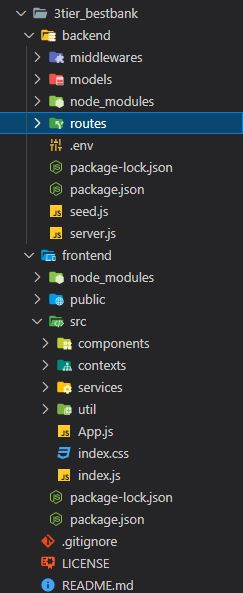

# Best Bank

Client, Server, and Database

## Description/Motivation: 

It’s an amazing journey so far! This application provides a great overview of 3 tier end to end architecture for a new developer. It includes secutiry aspects such as authentication and authorization. The data flows from client to web server to mongodb and vise versa. It provides a glimpse of how to create secured websites which stores users and their account information. Great exposure on how React components captures user events and gets the required data from database through server api calls.

## Installation Guidelines: 

 * Clone the 3tier_bestbank repo from github.
 * Follow package.json or import sections of code to install dependencies for both front end and back end code.
 * Create a cluster in mongodb and add connection path as DB to your .env file .
 * Add a JWTSECRET or some key which basically contains a string and add it to .env file so we can use it in backend - routes - auth.js file to create a token.
 * Start front and back end servers in 2 terminals using npm start. 
 * First run seed.js from backend terminal, so some user data will be added to cluster(database) collection (table). 
 * Create a new account or login and then explore remaining features.

## Technology used: 

 * NODE.JS server
 * NPM
 * Mongodb
 * Mongoose
 * React Library for frontend
 * Express framework for backend
 * MUI
 * Formik
 * Bcrypt
 * JWT
 * Google font
 * Styled-components
 * Yup
 * Nodemon
 * Cors
 * Dotenv
 * JSX
 * JS
 * HTML
 * CSS

## Features: 

This application alows us to create an account, login, view balance as well as all users, deposit and withdraw amount. Improvements would be transfor amount between different accounts, link accounts, admin roles, add footer.

#### Contact details: gv68682@gmail.com

### MIT License:

Copyright (c) 2020 John Williams

Permission is hereby granted, free of charge, to any person obtaining a copy
of this software and associated documentation files (the "Software"), to deal
in the Software without restriction, including without limitation the rights
to use, copy, modify, merge, publish, distribute, sublicense, and/or sell
copies of the Software, and to permit persons to whom the Software is
furnished to do so, subject to the following conditions:

The above copyright notice and this permission notice shall be included in all
copies or substantial portions of the Software.

THE SOFTWARE IS PROVIDED "AS IS", WITHOUT WARRANTY OF ANY KIND, EXPRESS OR
IMPLIED, INCLUDING BUT NOT LIMITED TO THE WARRANTIES OF MERCHANTABILITY,
FITNESS FOR A PARTICULAR PURPOSE AND NONINFRINGEMENT. IN NO EVENT SHALL THE
AUTHORS OR COPYRIGHT HOLDERS BE LIABLE FOR ANY CLAIM, DAMAGES OR OTHER
LIABILITY, WHETHER IN AN ACTION OF CONTRACT, TORT OR OTHERWISE, ARISING FROM,
OUT OF OR IN CONNECTION WITH THE SOFTWARE OR THE USE OR OTHER DEALINGS IN THE
SOFTWARE.
